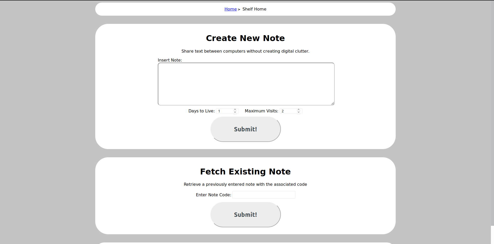

# Shelf
A place to temporarily share and store text without creating digital clutter.

## About
Have you ever needed to share a snippet of text like a URL, code snippet, or any other bit of text to a different computer?

Typically, one of the easiest ways to do that is to just email it to yourself, which creates a cluttered inbox.

This project aims to solve that problem. Input a text snippet of any length, and you'll get back a two word phrase (like `cat-dog`, or `excellent-useful`). Then, go to the Shelf on a different computer, enter that phrase, and the text will be available. And, with just a click of a button, that text can be copied to your clipboard.

Additionally, all snippets uploaded to the server are temporary, and either expire after a certain amount of time (Default: 24 hours) or after the note has been accessed a certain amount of times (Default: 2 times). This allows for easy text transfer, without leaving behind crumbs to clean up later.

## Installation

To install, clone the project, and install the requirements.

This project uses Python 3.6

You can easily install with pipenv: `pipenv install`

Then, just run Flask
```
export FLASK_APP=shelf.app
flask run
```

Once running, a database named `shelf.sqlite3` will automatically be created in the project directory, and everything should be taken care of!

## Website



The website is the primary interface to insert and retrieve notes.

To insert a note, just input text into the textarea, adjust the settings if needed, and submit!

To retrieve, just navigate to the home page, enter the code, and the note should appear!

You'll also have the option to copy the data to your clipboard. If your browser supports the [`navigator.clipboard.writeText` feature](https://developer.mozilla.org/en-US/docs/Web/API/Clipboard/writeText#Browser_compatibility), then it'll use that. If not, it will use the included [clipboard-polyfill](https://github.com/lgarron/clipboard-polyfill)

## API Endpoints

#### `/api/insert` (POST)
Insert a note into the database
##### Parameters
* `note` (Required) (string): The text content of the note
* `ttl_days` (int) (Must be 1 or more) (default: 1): The amount of days until the note expires
* `max_visits` (int) (Must be 1 or more) (default: 2): The amount of times the note can be accessed before it expires

##### Response
The server will send back the code to access the note, the max_visits, and the expiration date in UTC. See an example below

```json
{
  "expiry_date": "2019-06-13T01:30:20.913498Z",
  "id": "give-student",
  "max_visits": 2
}
```

#### `/api/fetch/<note_id>` (GET)
Fetch a note from the database
##### Parameters
* `<note_id>` (Required) (string): The code to access the note with. 

The note_id param goes into the URL, like the following example: `/api/fetch/give-student`

##### Response
If the note exists, the server will respond with all the data it has
```json
{
  "data": "test123",
  "expiry_date": "2019-06-13T01:30:20.913498Z",
  "id": "give-student",
  "insert_date": "2019-06-12T01:30:20.913498Z",
  "max_visits": 2,
  "visits": 0
}
```

If the note doesn't exist, an empty dictionary is returned: `{}`
